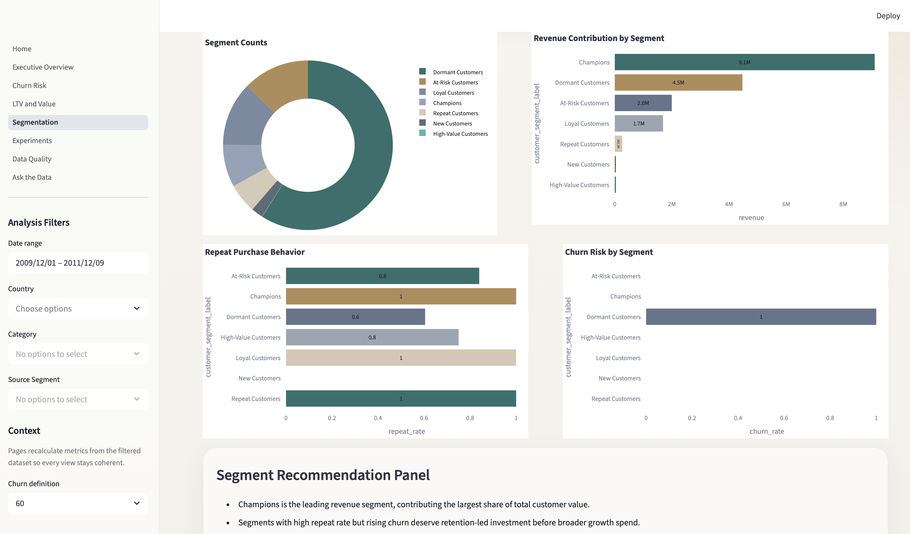
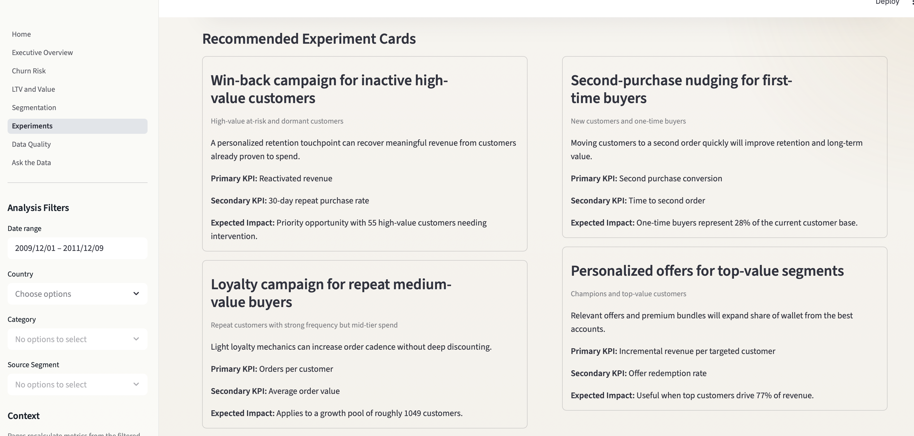

# 🚀 Customer Intelligence Copilot

### AI-Powered Customer Analytics & Decision Intelligence Platform

🔗 **Live App:** https://customer-intelligence-copilot.streamlit.app/
📂 **Repository:** https://github.com/arisettynithin-maker/customer-intelligence-copilot

---

## ⚡ 1-Minute Demo

A business team wants to understand customer behavior and improve revenue.

Using this tool:

1. Upload customer transaction data (or use demo dataset)
2. The system cleans, standardizes, and enriches the data
3. It analyzes:

   * Customer segments
   * Churn risk
   * Lifetime value
   * Revenue trends
4. The AI Copilot generates:

   * Key insights
   * Risk signals
   * Actionable recommendations

👉 **Result:** Raw data → Executive-ready decisions in seconds

---

## 🖼️ Product Walkthrough

### 🏠 Home & Entry Point


### 📊 Executive Overview Dashboard


### ⚠️ Churn Risk Analysis


### 💰 LTV & Value Distribution


### 🧩 Customer Segmentation



### 🧪 Experiment Recommendations



### 📉 Data Quality Layer


### 🤖 Ask the Data (AI Interface)


---

## 📊 Real Insights from the System

Using the built-in retail dataset:

* 💰 **Total Revenue:** ~$17.5M
* 📈 **Top 10% customers contribute ~64% of revenue**
* ⚠️ **Churn Rate:** ~59%
* 🎯 **High-value at-risk customers identified:** 55
* 💸 **Revenue at risk:** ~$6.45M

---

## 🧠 Key Business Insights

* Revenue is highly concentrated among top customers → retention is critical
* Significant drop-off across cohorts → onboarding and engagement gaps
* Dormant and at-risk segments represent major recovery opportunities
* Repeat customers show strong value → incentivizing second purchase is key

---

## 🚀 Recommended Actions (Generated by Copilot)

* 🎯 Launch win-back campaigns for high-value inactive customers
* ⚡ Improve onboarding to reduce early churn
* 💎 Offer personalized incentives to top-value segments
* 🔁 Encourage second purchase behavior to boost LTV

---

## 🤖 AI Copilot – What It Actually Does

Unlike traditional dashboards, this system:

* Translates data → insights
* Translates insights → actions

### Example Output:

**Insight Summary:**

* High-value users dominate revenue contribution
* Early-stage churn is significant

**Recommended Actions:**

* Prioritize retention for top 10% customers
* Introduce onboarding nudges for new users
* Target dormant users with reactivation campaigns

---

## ⚙️ Core Features

* 📊 Executive dashboards (Revenue, Customers, Trends)
* ⚠️ Churn risk detection (RFM-based logic)
* 💰 LTV & value distribution analysis
* 🧩 Customer segmentation engine
* 🧪 Experimentation & campaign recommendations
* 📉 Data quality validation layer
* 🤖 Natural-language “Ask the Data” interface

---

## 🛠️ Tech Stack

* **Python** (Pandas, NumPy)
* **Streamlit** (UI & app framework)
* **LLM Integration** (AI insights & recommendations)
* **Matplotlib / Plotly** (visualization)

---

## 📂 Project Structure

```bash
customer-intelligence-copilot/
├── data/
├── pages/
├── screenshots/
├── src/
├── gitignore
├── README.md
├── app.py
└── requirements.txt
```

---

## ▶️ Run Locally

```bash
git clone https://github.com/arisettynithin-maker/customer-intelligence-copilot.git
cd customer-intelligence-copilot

pip install -r requirements.txt
streamlit run app.py
```

---

## 🏆 Why This Project Stands Out

This is not just an analytics project.

It demonstrates:

* Product thinking in data
* AI-assisted decision making
* End-to-end data workflow (cleaning → modeling → insight → action)

👉 This reflects how modern data teams operate today.

---

## 🔬 Future Improvements

* Add real-time data pipelines (streaming ingestion)
* Integrate ML-based churn & LTV prediction models
* Deploy scalable backend (AWS / APIs)
* Improve AI evaluation & prompt reliability

---

## 💡 Author

Built by **Nithin Arisetty**
Data Analytics | AI-driven Decision Systems

---

## ⭐ If you found this useful

Give the repo a ⭐ and feel free to connect!
